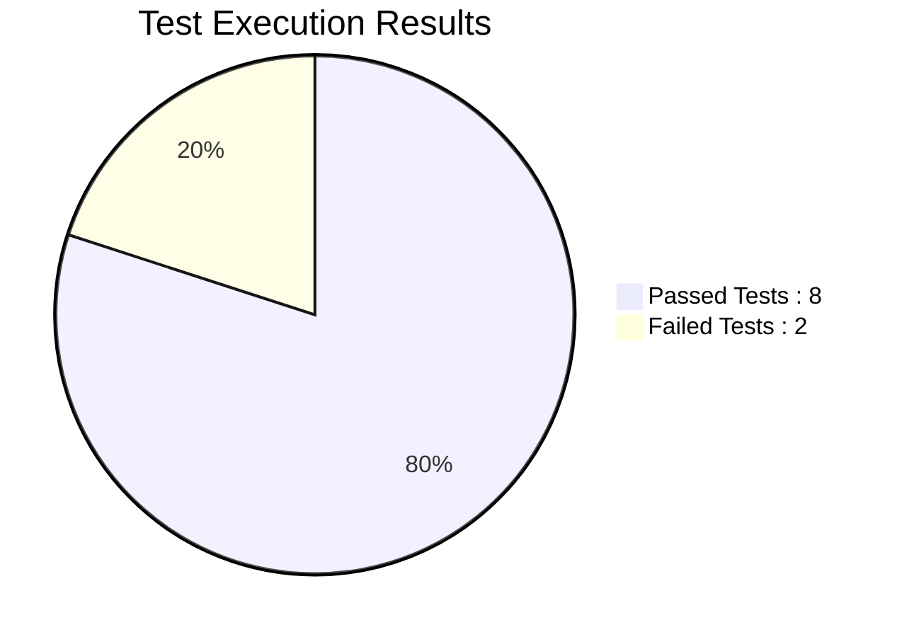
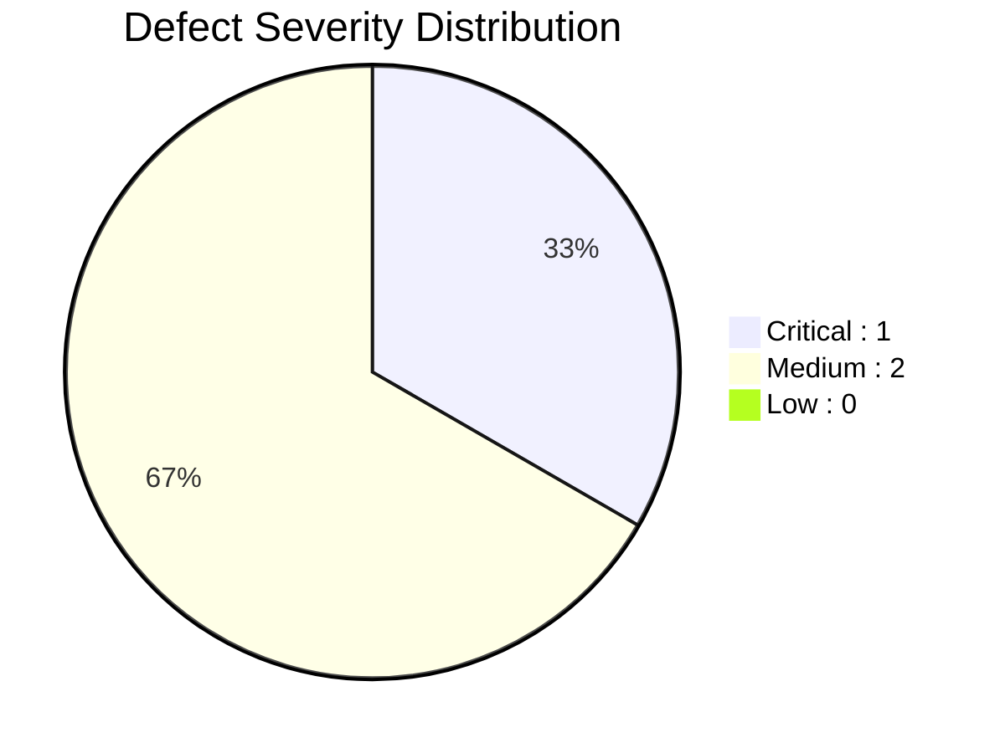
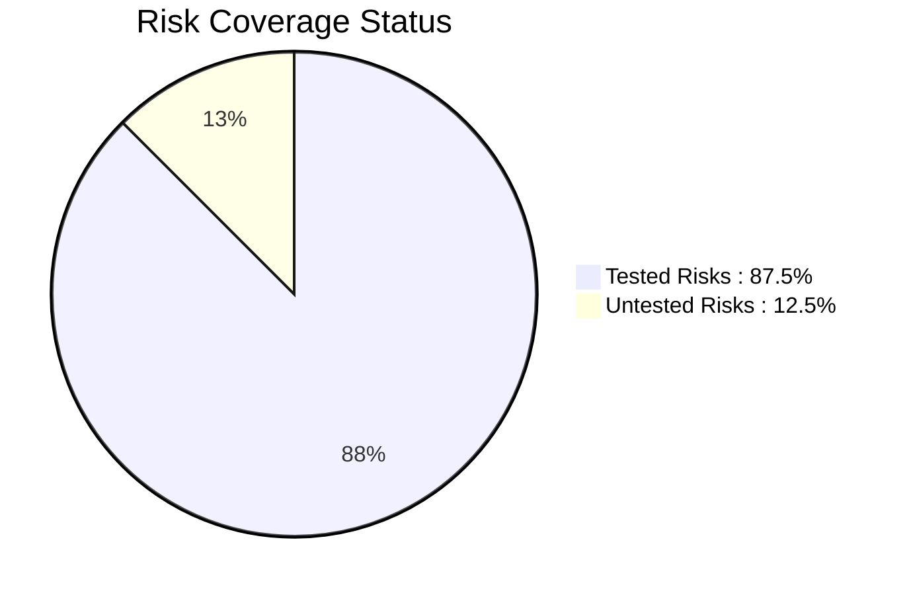
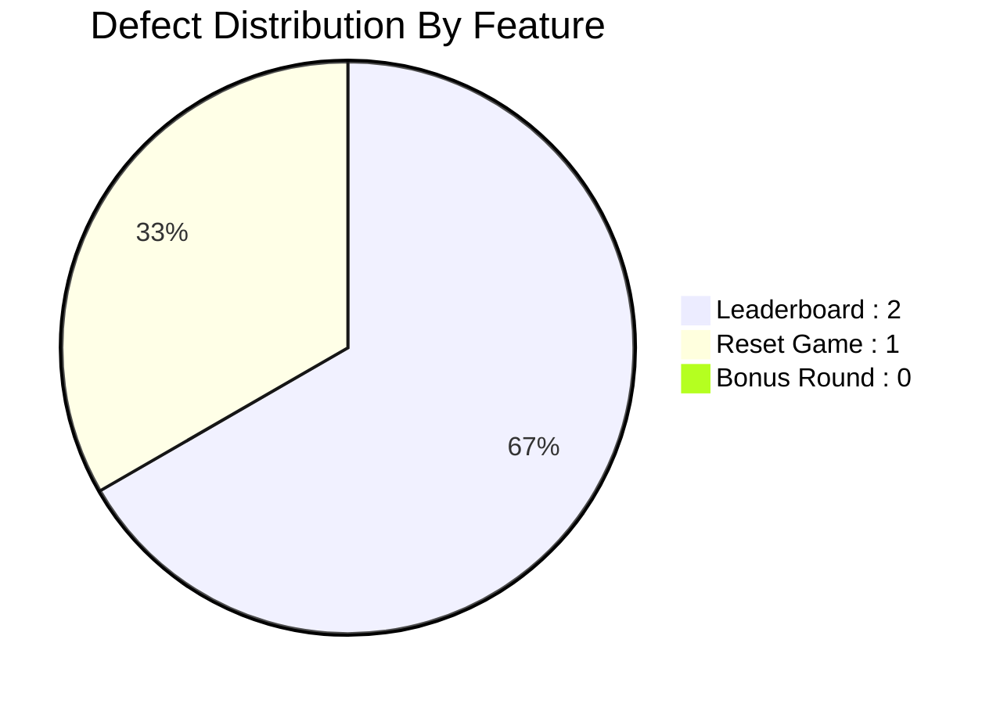

# 🧪 Test Monitoring & Metrics

```mermaid
pie title Test Execution Results
    "Passed Tests : 8 " : 8
    "Failed Tests : 2 " : 2
```

```mermaid
pie title Defect Severity Distribution
    "Critical : 1 " : 1
    "Medium : 2 " : 2
    "Low : 0 " : 0
```

```mermaid
pie title Risk Coverage Status
    "Tested Risks : 87.5% " : 87.5
    "Untested Risks : 12.5% " : 12.5
```

```mermaid
pie title Defect Distribution By Feature
    "Leaderboard : 2 " : 2
    "Reset Game : 1 " : 1
    "Bonus Round : 0 " : 0
```
